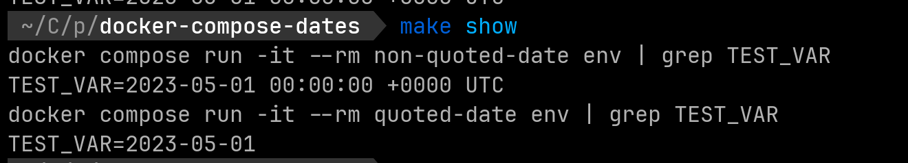

# Docker Compose Date Interpretations

A docker-compose.yml configuration showing that unquoted date values set in environment variables are interpreted into a complete date time.

_An example of running the available Makefile command showing different values based on quotes being present._

## Running this on your own system

You can run this example on your own system. Before following the steps below please ensure you're running an updated version of Docker and Docker Compose.

At the time of creating this repo the author had the following versions:

- Docker version 23.0.5, build bc4487a
- Docker Compose version v2.17.3

1. Clone this repo: `git clone git@github.com/cspray/docker-compose-dates`
2. Run the make command `make show`

If you don't have `make` available on your system you can run the following commands separately:

	docker compose run -it --rm non-quoted-date env | grep TEST_VAR
	docker compose run -it --rm quoted-date env | grep TEST_VAR
